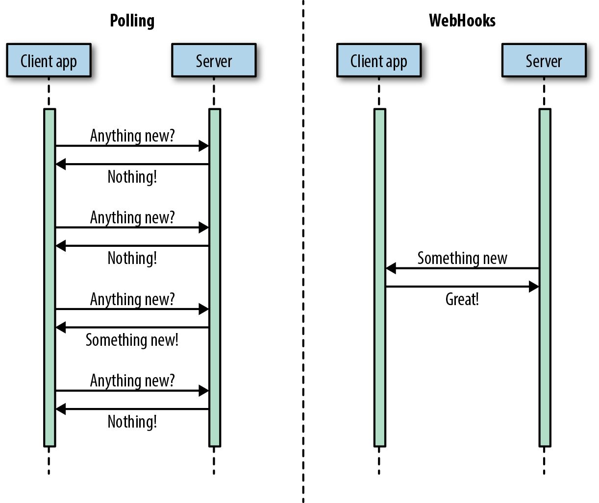
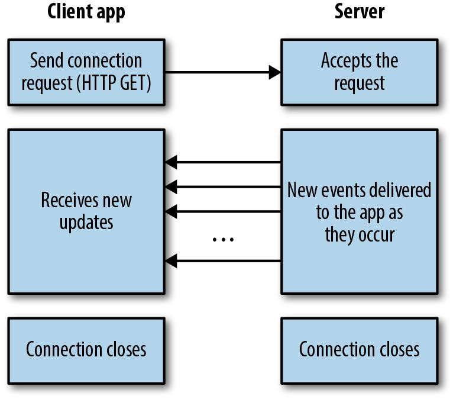

# Web Services

Notes based in part on the book *Designing Web APIs*, by Jin, Sahni & Shevat

## APIs

**API**: application programming interface

Over the years, multiple API paradigms have emerged. _REST_, _RPC_, _GraphQL_,
_WebHooks_, and _WebSockets_ are some of the most popular standards today.

### Request–Response APIs

Request–response APIs typically expose an interface through an HTTP-based web
server.

Clients send HTTP request to the server, and gets back JSON or XML responses.

#### Representational State Transfer (REST)

[https://restfulapi.net/](https://restfulapi.net/)

Most common, or popular, architecture. It's about giving access to resources.

##### Architectural Constraints

REST defines 6 architectural constraints which make any web service – a truly
RESTful API.

1. Uniform interface
2. Client–server
3. Stateless
4. Cacheable
5. Layered system
6. Code on demand (optional)

#### Remote Procedure Call (RPC)

Whereas REST is about resources, RPC is about actions. Clients typically pass a
method name and arguments to a server and receive back JSON or XML.

#### GraphQL

GraphQL allows clients to define the structure of the data required, and the
server returns exactly that structure.

##### GraphQL query

````graphql
{
  user(login: "saurabhsahni") {
    id
    name
    company
    createdAt
  }
}
````

##### Response from GitHub GraphQL API

````json
{
  "data": {
    "user": {
      "id": "MDQ6VXNlcjY1MDI5",
      "name": "Saurabh Sahni",
      "company": "Slack",
      "createdAt": "2009-03-19T21:00:06Z"
    }
  }
}
````

Unlike REST and RPC APIs, GraphQL APIs need only a single URL endpoint.
Similarly, you do not need different HTTP verbs to describe the operation.
Instead, you indicate in the JSON body whether you’re performing a query or a
mutation. GraphQL APIs support GET and POST
verbs.

#### Comparison of request–response API paradigms

|                  | REST                                                                                  | RPC                                                                       | GraphQL                                                                                                  |
|------------------|---------------------------------------------------------------------------------------|---------------------------------------------------------------------------|----------------------------------------------------------------------------------------------------------|
| What?            | Exposes data as resources and uses standard HTTP methods to represent CRUD operations | Exposes action-based API methods — clients pass method name and arguments | A query language for APIs — clients define the structure of the response                                 |
| Example services | Stripe, GitHub, Twitter, Google                                                       | Slack, Flickr                                                             | Facebook, GitHub, Yelp                                                                                   |
| HTTP verbs used  | GET, POST, PUT, PATCH, DELETE                                                         | GET, POST                                                                 | GET, POST                                                                                                |
| Pros             | Standard method name, arguments format, and status codes                              | Easy to understand                                                        | Saves multiple round trips                                                                               |
|                  | Utilizes HTTP features                                                                | Lightweight payloads                                                      | Avoids versioning                                                                                        |
|                  | Easy to maintain                                                                      | High performance                                                          | Smaller payload size                                                                                     |
|                  |                                                                                       |                                                                           | Strongly typed                                                                                           |
|                  |                                                                                       |                                                                           | Built-in introspection                                                                                   |
| Cons             | Big payloads                                                                          | Discovery is difficult                                                    | Requires additional query parsing                                                                        |
|                  | Multiple HTTP round trips                                                             | Limited standardization                                                   | Backend performance optimization is difficult                                                            |
|                  |                                                                                       | Can lead to function explosion                                            | Too complicated for a simple API                                                                         |
| When to use?     | For APIs doing CRUD-like operations                                                   | For APIs exposing several actions                                         | When you need querying flexibility; great for providing querying flexibility and maintaining consistency |

### Event-Driven APIs

With request–response APIs, for services with constantly changing data, the
response can quickly become stale. Developers who want to stay up to date with
the changes in data often end up polling the API. With polling, developers
constantly query API endpoints at a predetermined frequency and look for new
data.

To share data about events in real time, there are three common mechanisms:
WebHooks, WebSockets, and HTTP Streaming

#### WebHooks

A WebHook is just a URL that accepts an HTTP POST (or GET, PUT, or DELETE). An
API provider implementing WebHooks will simply POST a message to the configured
URL when something happens.



#### WebSockets

WebSocket is a protocol used to establish a two-way streaming communication
channel over a single Transport Control Protocol (TCP) connection. Although the
protocol is generally used between a web client (e.g., a browser) and a server,
it’s sometimes used for server-to-server communication, as well.

WebSockets can enable full-duplex communication (server and client can
communicate with each other simultaneously) at a low overhead

#### HTTP Streaming

With the HTTP request–response APIs, clients send an HTTP request and the server
returns an HTTP response of a finite length. With HTTP Streaming, the server can
continue to push new data in a single long-lived connection opened by a client.



#### Comparison of event-driven APIs

| 	                 | WebHooks                                        | 	WebSockets                                                       | 	HTTP Streaming                                    |
|-------------------|-------------------------------------------------|-------------------------------------------------------------------|----------------------------------------------------|
| What?             | Event notification via HTTP callback	           | Two-way streaming connection over TCP	                            | Long-lived connection over HTTP                    |
| Example services	 | Slack, Stripe, GitHub, Zapier, Google	          | Slack, Trello, Blockchain	                                        | Twitter, Facebook                                  |
| Pros              | Easy server-to-server communication             | Two-way streaming communication                                   | Can stream over simple HTTP                        |
|                   | Uses HTTP protocol                              | Native browser support                                            | Native browser support                             |
|                   |                                                 | Can bypass firewalls                                              | Can bypass firewalls                               |
| Cons              | Do not work across firewalls or in browsers     | Need to maintain a persistent connection                          | Bidirectional communication is difficult           |  
|                   | Handling failures, retries, security is hard    | Not HTTP                                                          | Reconnections required to receive different events |
| When to use?      | To trigger the server to serve real-time events | For two-way, real-time communication between browsers and servers | For one-way communication over simple HTTP         |
